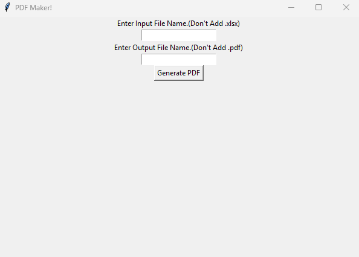
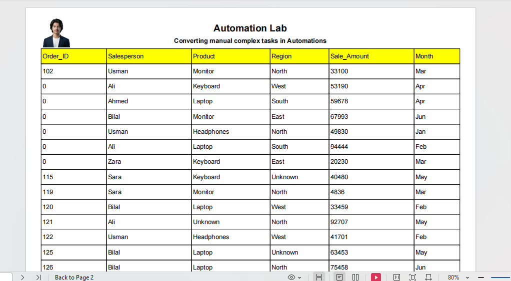

# 📄 Excel to PDF Converter

A simple desktop tool to convert Excel files into professional PDF reports — with just one click!

Built with **Python**, **Pandas**, **fpdf2**, and **Tkinter**.

---

## 🖥️ GUI Preview




---

## ✨ Features

- Convert any Excel (.xlsx) file to a formatted PDF report
- Auto-generated table with headers on every page
- Company name and tagline on the first page
- Simple and clean GUI — no coding required to use
- Error handling for missing or incorrect files

---

## 📦 Requirements

Install dependencies using pip:

```bash
pip install pandas fpdf2 openpyxl
```

---

## 🚀 How to Use

1. Clone the repository:
```bash
git clone https://github.com/abdullahautomation/convert_excel_to_pdf.git
```

2. Navigate to the project folder:
```bash
cd convert_excel_to_pdf
```

3. Run the GUI:
```bash
python gui.py
```

4. Enter your Excel file name (without `.xlsx`)
5. Enter your desired output PDF name (without `.pdf`)
6. Click **Generate PDF** — done! ✅

---

## 📁 Project Structure

```
convert_excel_to_pdf/
│
├── gui.py          # Tkinter GUI
├── pdf_maker.py    # Excel to PDF logic
├── README.md       # Project documentation
```

---

## 🛠️ Built With

- [Python](https://www.python.org/)
- [Pandas](https://pandas.pydata.org/)
- [fpdf2](https://py-fpdf2.readthedocs.io/)
- [Tkinter](https://docs.python.org/3/library/tkinter.html)

---

## 👨‍💻 Author

**Abdullah**  
🔗 [GitHub](https://github.com/abdullahautomation)  
🌐 [Fiverr](https://www.fiverr.com/abdullah7514)

---

## 📃 License

This project is open source and available under the [MIT License](LICENSE).